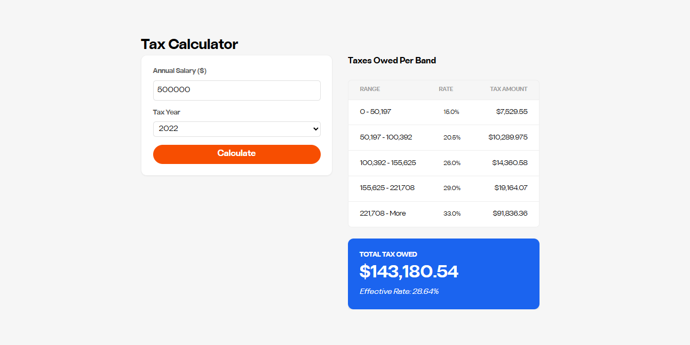

# Tax Calculator (React)



A simple and scalable **Tax Calculator** built with **React**, designed to calculate taxes based on a user-provided salary and dynamically fetched tax brackets by year.

The application focuses on clean separation of concerns, performance optimizations, request cancellation, and a predictable data flow.

---

## ✨ Features

- Dynamic tax calculation based on salary and year
- Async tax bracket fetching with request cancellation
- Memoized tax calculations for performance
- Fully configurable form system
- Graceful loading, empty, and error states
- Centralized logging and event tracking

---

## 🧠 Architecture Overview

The app follows a **smart container + presentational components** approach:

- **App** → Orchestrates state, side effects, and data flow
- **DynamicForm** → Renders the form based on configuration
- **TaxResultsTable** → Displays computed tax results
- **EmptyStatePlaceholder** → Shown when no calculation is available

Core business logic (tax calculation, API calls, logging) is abstracted into reusable utilities and services.

---

## 📁 Project Structure

```
src/
├── api/
│   └── taxService.js          # Fetches tax brackets with cancellation support
├── components/
│   ├── DynamicForm.jsx        # Config-driven form component
│   ├── TaxResultsTable.jsx    # Renders tax calculation results
│   └── EmptyStatePlaceholder.jsx
├── constants/
│   └── taxConstants.js        # Form config and default values
├── utils/
│   ├── calculator.js          # Tax calculation logic
│   └── logger.js              # Logging & tracking abstraction
├── App.jsx                    # Main application component
└── main.jsx
```

---

## 🧮 Tax Calculation Flow

1. User enters salary and selects a year
2. `handleCalculate` is triggered
3. Tax brackets are fetched (if not already cached for that year)
4. Taxes are calculated using the provided salary and brackets
5. Results are memoized and rendered in the results table

---

## 📡 Tax Service (`taxService`)

### Responsibility

The tax service is responsible for fetching tax brackets from the backend **while preventing race conditions** caused by multiple concurrent requests (e.g. when users quickly switch between years).

### Why cancellation is used

This service uses a module-level `AbortController` to ensure that:

- Only the **latest request** is allowed to complete
- Previous in-flight requests are explicitly aborted
- Stale responses never override fresh application state

This pattern is especially important in UI-driven applications where users can trigger rapid consecutive requests.

### Design decisions

- **Single shared AbortController**
  - Guarantees one active request at a time
  - Simplifies state management at the application level

- **No internal error handling**
  - Errors are intentionally re-thrown
  - The caller decides how to handle network failures vs cancellations

- **Thin abstraction**
  - The service delegates HTTP concerns to `localFetch`
  - Keeps the service focused on orchestration, not transport details

### Expected behavior

- Calling the function multiple times in quick succession will abort previous requests
- `AbortError` / `CanceledError` are expected and should be ignored by consumers
- Network or server errors should be handled at the UI layer

---

## 🧮 Tax Calculator Core (`calculator.js`)

### Responsibility

This module contains the **pure business logic** responsible for calculating taxes based on a salary and a set of tax brackets.

It is intentionally designed to be:

- **Deterministic** (same input → same output)
- **Side‑effect free**
- **Framework‑agnostic**

This makes it easy to test, reason about, and reuse.

---

### Inputs

- `salary: number`
  - Gross salary to be evaluated
  - Must be a positive number

- `brackets: Array`
  - Progressive tax brackets
  - Each bracket is expected to contain:
    - `min: number`
    - `max: number | null`
    - `rate: number` (decimal, e.g. `0.25`)

---

### Output

The function returns an object with:

- `totalTax: number`
  - Total tax amount (rounded to 2 decimals)

- `breakdown: Array`
  - Per‑bracket tax contribution
  - Useful for UI representation and auditing

- `effectiveRate: string`
  - Effective tax rate as a percentage string

---

### Design decisions

- **No validation of bracket structure**
  - Assumes brackets are already sanitized by the API layer
  - Keeps calculation logic focused and lightweight

- **Early return for invalid salaries**
  - Prevents unnecessary iteration
  - Avoids defensive checks inside the loop

- **Progressive calculation model**
  - Each bracket only taxes the portion of income within its range
  - The last bracket may have no upper limit

---

### What this module intentionally does NOT do

- Fetch data
- Handle formatting for UI (except minimal numeric normalization)
- Apply country‑specific rules beyond progressive brackets

This separation allows future tax rules to be implemented without rewriting the UI or data layer.

---

## 🧩 Dynamic Form Component (`DynamicForm`)

### Responsibility

`DynamicForm` is a **configuration‑driven form renderer** built on top of `react-hook-form`.

Its goal is to decouple **form structure and validation rules** from UI implementation, allowing forms to be modified or extended **without changing component code**.

---

### Why a config‑driven approach

This component exists to solve common UI scalability problems:

- Avoid duplicating form markup across screens
- Centralize validation rules
- Enable rapid changes to form fields without touching JSX
- Reduce the surface area for bugs when requirements change

For small, one‑off forms this approach would be unnecessary. Here, it is intentional and forward‑looking.

---

### Expected configuration shape

Each field in `config` is expected to define:

- `name` — form field key
- `label` — UI label
- `type` — input type (`text`, `number`, `select`, etc.)
- `placeholder` (optional)
- `options` (required for `select` fields)
- `validation` — rules passed directly to `react-hook-form`

This keeps validation declarative and colocated with field definition.

---

### Design decisions

- **Leverages `react-hook-form`**
  - Minimizes re‑renders
  - Keeps form state performant and predictable

- **No internal submission logic**
  - The component only orchestrates UI and validation
  - Business logic is always owned by the caller

- **Explicit loading state**
  - Disables submission
  - Shows a spinner to prevent duplicate requests

---

### What this component intentionally does NOT do

- Manage API calls
- Contain business rules
- Handle complex conditional field logic

Those concerns belong to higher‑level components or domain logic.

---

## ⚡ Performance Optimizations

- **`useMemo`**
  - Prevents unnecessary recalculation of taxes when inputs have not changed

- **`useCallback`**
  - Ensures stable function references for form submission

- **Request cancellation**
  - Prevents race conditions when switching years quickly

---

## 🛑 Error Handling

- Network failures are handled gracefully
- Request cancellations are silently ignored
- User-friendly error messages are displayed in the UI

Example error message:

> "Server connection failed. Please try again."

---

## 📝 Logging & Tracking

The app uses a centralized logger abstraction:

- `logger.info()` → Informational events
- `logger.error()` → Errors and failures
- `logger.track()` → Analytics / tracking events

This makes the app easy to integrate with external logging or analytics platforms.

---

## 🔧 Configuration-Driven Form

The form is generated dynamically using:

- `taxFormConfig`
- `defaultTaxValues`

This allows:

- Easy field additions/removals
- Reuse of the form component
- Zero UI changes for business logic updates

---

## 🚀 Getting Started

### Prerequisites

- Node.js >= 18.x
- npm >= 9.x

### Installation & Development

```bash
# Install dependencies
npm install

# Start development server
npm run dev
```

The app will be available at `http://localhost:5173`

### Running Tests

```bash
# Unit tests (Vitest)
npm test

# E2E tests (Playwright)
npm run test:e2e

# All tests
npm run test:all
```

### Building for Production

```bash
npm run build
npm run preview
```

## 🔌 Backend API

This app requires a backend service running on `http://localhost:5050`

### Quick Start with Docker

```bash
docker pull ptsdocker16/interview-test-server
docker run --init -p 5050:5050 -it ptsdocker16/interview-test-server
```

### API Documentation

**Endpoint:**

```
GET /tax-calculator/tax-years/{year}
```

**Example Request:**

```bash
curl http://localhost:5050/tax-calculator/tax-years/2022
```

**Response:**

```json
{
  "tax_brackets": [
    { "min": 0, "max": 50000, "rate": 0.15 },
    { "min": 50001, "max": 100000, "rate": 0.25 },
    { "min": 100001, "max": null, "rate": 0.3 }
  ]
}
```

> **Note:** If the backend is unavailable, the app will display:  
> "Server connection failed. Please try again."
